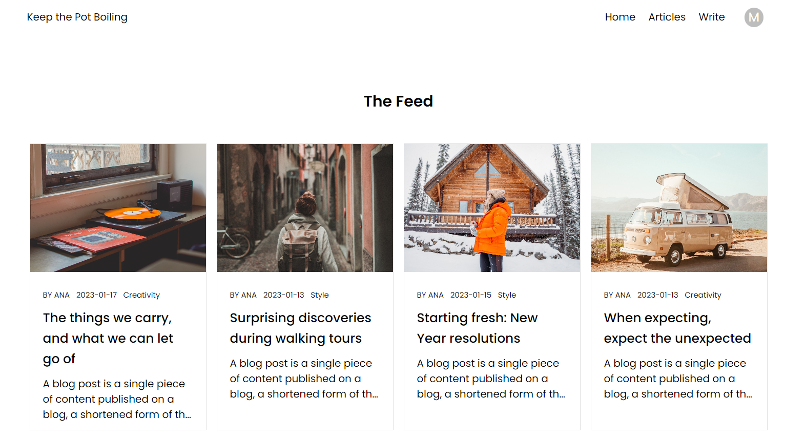
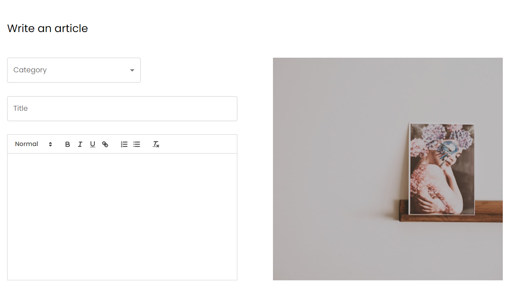

### Links

- Live Site URL: [keep-the-pot-boiling-blog.netlify.app/](https://keep-the-pot-boiling-blog.netlify.app/)

### Screenshot

### About the blog

- View the optimal layout for the site depending on their device's screen size
- See hover and active states for all interactive elements on the page
- Usage of Unsplash API to search for images and integrate them into the article.
- Users can create articles, like articles, leave comments on articles.
- Admin page where admin can create, edit and delete categories and articles.
- Back-end for register, login, profile, categories, articles, comments, likes.

### Built with

- React
- TypeScript
- Material UI
- Unsplash API
- Redux Toolkit
- React Router
- Express js
- MongoDB
- Mongoose

### Backend

- Repository: [github.com/BiancaGlavan/rest-api-blog-backend](https://github.com/BiancaGlavan/rest-api-blog-backend)

